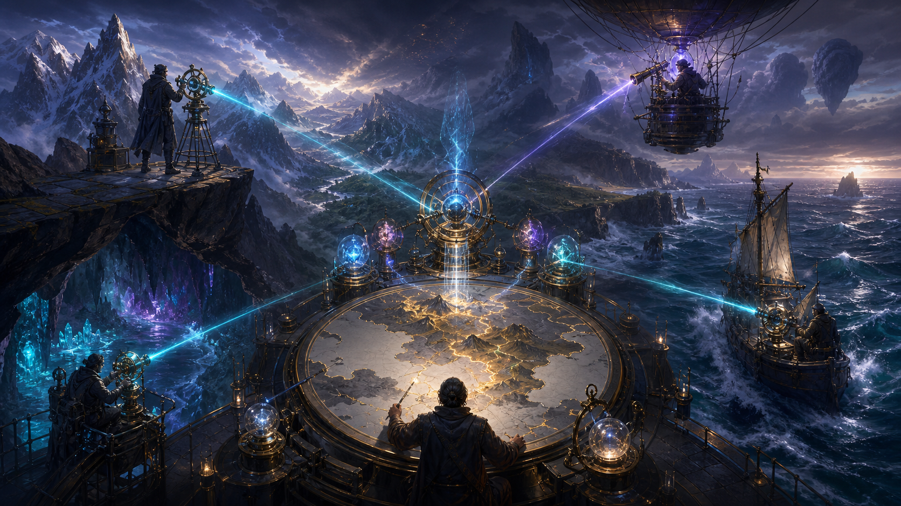
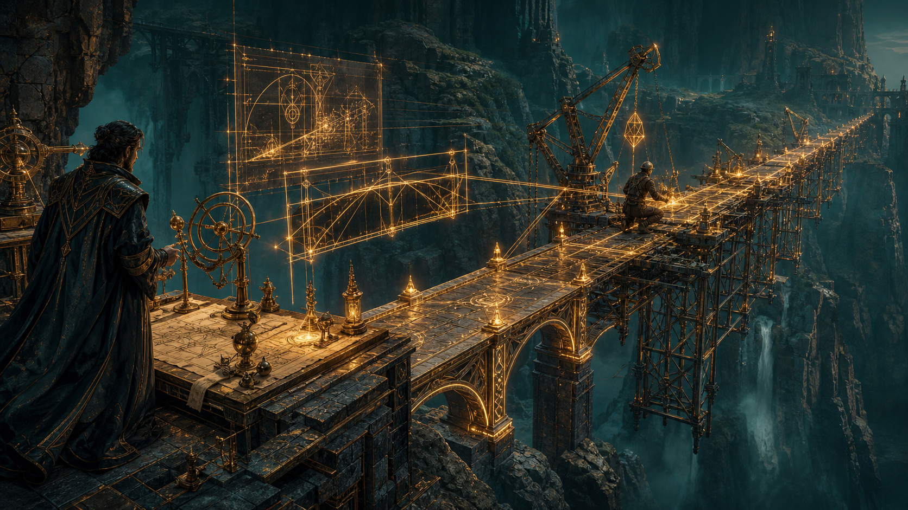
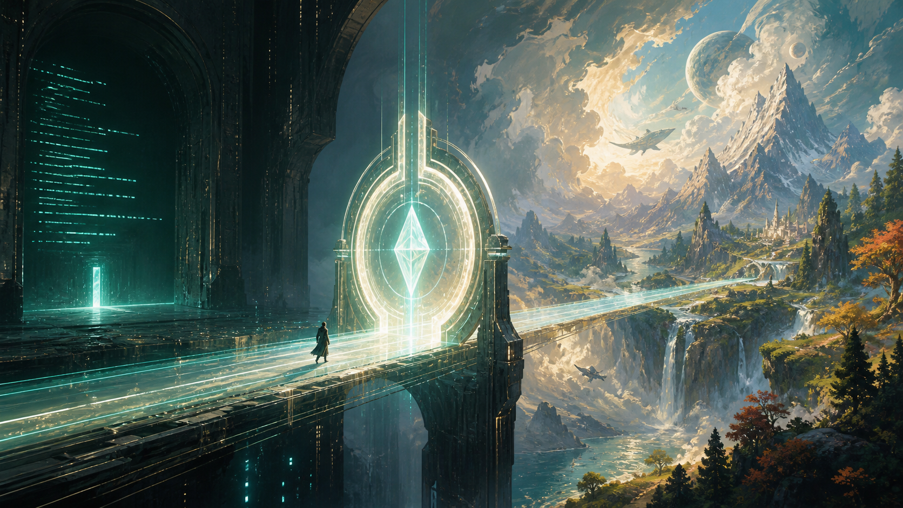

# Grimoire

Agent skills I wrote down. Each skill is a `SKILL.md`. Ultracode also ships the Rhai workflow it launches.

Copy or symlink a skill into a directory your agent already scans. Invoke it by name or slash command. The skill files own the steps. This page only says what is here and where to put it.

## What's here

**ultracode.** More than one specialist reviewer, then independent verification of each distinct claim, then a judge. Invoke with `/ultracode` plus an objective and a target. The current chat does not answer the review. It launches `ultracode.rhai`.

The run is Review, Verify, Adjudicate. Findings that fail shape, calibration, source rules, or the quality gate go into `qualityRejected`. Claims with no usable verdict go into `noVerdict`. The judge only sees Review+Verify cases. You get every bucket back, including empty ones. Do not use this for ordinary `/review` or for writing workflows.



**prewalk.** A frontier model (`Sol`, `Fable` or `grok-4.6`) reads the code, writes 7-11 todos with `todo_write`, and lands the first edit. Then you switch to a cheap model with `/model luna` or `/model terra` and say continue. The live TUI conversation is the handoff. Do not `spawn_subagent` for execution. Do not write a handoff markdown file. Skip it for sprawling multi-domain work and for a one-line fix. Headless `grok -p` cannot switch models mid-run.



**codex-imagegen.** Generate or edit an image through Codex CLI `$imagegen` with ChatGPT or Codex login. No `OPENAI_API_KEY`. Keep `$imagegen` in single quotes so the shell does not expand it.



## Install

Clone [github.com/dymayday/grimoire](https://github.com/dymayday/grimoire), then symlink:

```bash
git clone https://github.com/dymayday/grimoire.git
cd grimoire
ln -s "$(pwd)/skills/ultracode" ~/.grok/skills/ultracode
ln -s "$(pwd)/skills/prewalk" ~/.grok/skills/prewalk
ln -s "$(pwd)/skills/codex-imagegen" ~/.grok/skills/codex-imagegen
```

Grok also reads `~/.claude/skills/` and a project's `.grok/skills/`. To scan the tree without symlinks:

```toml
[skills]
paths = ["/absolute/path/to/grimoire/skills"]
```

Type `/` and look for the names, or run `grok inspect`.

## Patches

`patches/grok-build` is the source of truth for local grok-build patches.
See that folder's README. Symlink it into a grok-build clone:

```bash
ln -sfn "$(pwd)/patches/grok-build" /absolute/path/to/grok-build/local-patches
```

Keep `/local-patches` in grok-build `.git/info/exclude` so Git
ignores the symlink. Then run
`./local-patches/apply-and-build.sh` from grok-build, or use `update-grok`.

## Layout

```
skills/ultracode/SKILL.md
skills/ultracode/ultracode.rhai
skills/prewalk/SKILL.md
skills/codex-imagegen/SKILL.md
patches/grok-build/README.md
patches/grok-build/apply-and-build.sh
patches/grok-build/spawn-subagent-reasoning-effort.patch
```
